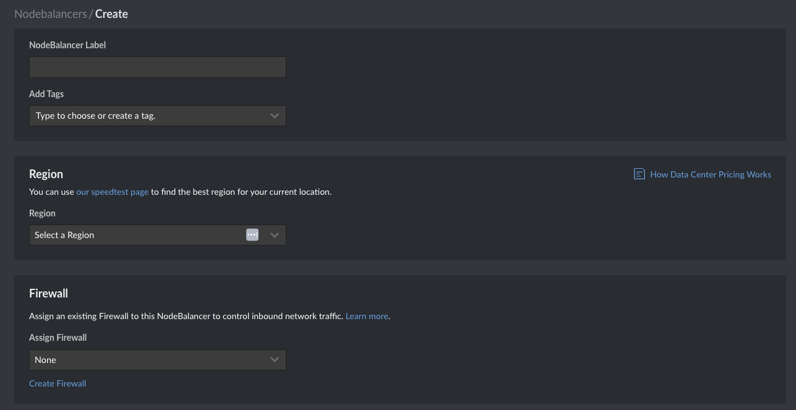
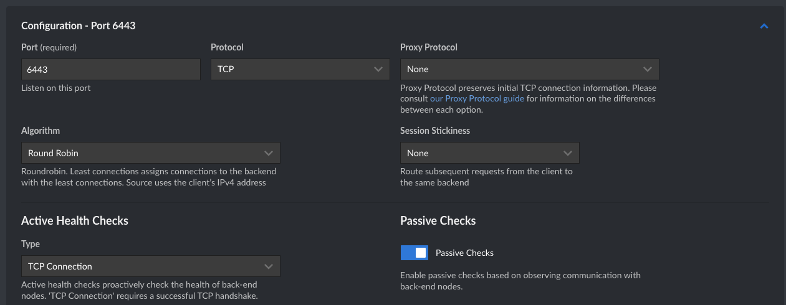
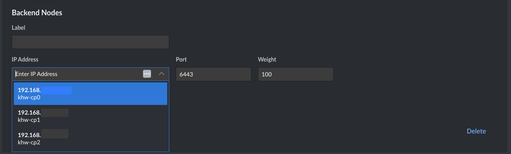

# Provisioning Compute Instances

In this lab we'll be creating the compute instances for our cluster. Kubernetes requires two types of machines: worker nodes, where the application containers are executed, and the control plane, which is in charge of managing them. We'll be creating three of each, plus a NodeBalancer in front of the CP.

## Compute instances

During the labs we'll authenticate to our compute instances using SSH authentication. If you already have an SSH key pair and want to leverage it, you can move to the next step. Else, [follow this guide](https://www.linode.com/docs/guides/use-public-key-authentication-with-ssh/#generate-an-ssh-key-pair) to create a new one.

```sh
ssh-keygen -t ed25519 -C "user@domain.tld"
```

Next, to make automation easier, we'll add the key and password as environment variables

```sh
PASSWORD=$(openssl rand --base64 32)
AUTHZKEY=$(cat ~/.ssh/[key].pub)
```

And with this, we can create our worker nodes using Linode CLI, using:


```sh
for i in 0 1 2; do
    linode linodes create --no-defaults --type g6-nanode-1 --region us-lax --image linode/ubuntu22.04 --root_pass $PASSWORD --authorized_keys $AUTHZKEY --backups_enabled false --interfaces.purpose public --interfaces.purpose vlan --interfaces.label khw --interfaces.ipam_address 10.240.0.2${i}/24 --tags khw --tags khw-wn --label khw-wn${i}
done
```

Note that we're assigning a VLAN (using `interfaces.purpose`), setting a static private address for making things easier when we bootstrap the nodes. You can [read more about VLANs here](https://www.linode.com/docs/products/networking/vlans/get-started/). Alternatively, you can use a VPC (in beta, at the time of writing)

Result:

```
┌──────────┬─────────┬────────┬─────────────┬────────────────────┬──────────────┬─────────────────┐
│ id       │ label   │ region │ type        │ image              │ status       │ ipv4            │
├──────────┼─────────┼────────┼─────────────┼────────────────────┼──────────────┼─────────────────┤
│ XXXXXXX8 │ khw-wn0 │ us-lax │ g6-nanode-1 │ linode/ubuntu22.04 │ provisioning │ XXX.XXX.XXX.XXX │
└──────────┴─────────┴────────┴─────────────┴────────────────────┴──────────────┴─────────────────┘
┌──────────┬─────────┬────────┬─────────────┬────────────────────┬──────────────┬─────────────────┐
│ id       │ label   │ region │ type        │ image              │ status       │ ipv4            │
├──────────┼─────────┼────────┼─────────────┼────────────────────┼──────────────┼─────────────────┤
│ XXXXXXX9 │ khw-wn1 │ us-lax │ g6-nanode-1 │ linode/ubuntu22.04 │ provisioning │ XXX.XXX.XXX.XXX │
└──────────┴─────────┴────────┴─────────────┴────────────────────┴──────────────┴─────────────────┘
┌──────────┬─────────┬────────┬─────────────┬────────────────────┬──────────────┬─────────────────┐
│ id       │ label   │ region │ type        │ image              │ status       │ ipv4            │
├──────────┼─────────┼────────┼─────────────┼────────────────────┼──────────────┼─────────────────┤
│ XXXXXXX0 │ khw-wn2 │ us-lax │ g6-nanode-1 │ linode/ubuntu22.04 │ provisioning │ XXX.XXX.XXX.XXX │
└──────────┴─────────┴────────┴─────────────┴────────────────────┴──────────────┴─────────────────┘
```

We'll do the same for the control plane:

```sh
for i in 0 1 2; do
    linode linodes create --no-defaults --type g6-nanode-1 --region us-lax --image linode/ubuntu22.04 --root_pass $PASSWORD --authorized_keys $AUTHZKEY --backups_enabled false --private_ip true --interfaces.purpose public --interfaces.purpose vlan --interfaces.label khw --interfaces.ipam_address 10.240.0.1${i}/24 --tags khw --tags khw-cp --label khw-cp${i}
done
```

Here we make a small adjustment to get a private address (`private_ip true`) for this instance so we can distribute the load of the API calls using a NodeBalancer.

Result:

```
┌──────────┬─────────┬────────┬─────────────┬────────────────────┬──────────────┬──────────────────────────────────┐
│ id       │ label   │ region │ type        │ image              │ status       │ ipv4                             │
├──────────┼─────────┼────────┼─────────────┼────────────────────┼──────────────┼──────────────────────────────────┤
│ XXXXXXX6 │ khw-cp0 │ us-lax │ g6-nanode-1 │ linode/ubuntu22.04 │ provisioning │ XXX.XXX.XXX.XXX, 192.168.XXX.XXX │
└──────────┴─────────┴────────┴─────────────┴────────────────────┴──────────────┴──────────────────────────────────┘
┌──────────┬─────────┬────────┬─────────────┬────────────────────┬──────────────┬──────────────────────────────────┐
│ id       │ label   │ region │ type        │ image              │ status       │ ipv4                             │
├──────────┼─────────┼────────┼─────────────┼────────────────────┼──────────────┼──────────────────────────────────┤
│ XXXXXXX7 │ khw-cp1 │ us-lax │ g6-nanode-1 │ linode/ubuntu22.04 │ provisioning │ XXX.XXX.XXX.XXX, 192.168.XXX.XXX │
└──────────┴─────────┴────────┴─────────────┴────────────────────┴──────────────┴──────────────────────────────────┘
┌──────────┬─────────┬────────┬─────────────┬────────────────────┬──────────────┬──────────────────────────────────┐
│ id       │ label   │ region │ type        │ image              │ status       │ ipv4                             │
├──────────┼─────────┼────────┼─────────────┼────────────────────┼──────────────┼──────────────────────────────────┤
│ XXXXXXX8 │ khw-cp2 │ us-lax │ g6-nanode-1 │ linode/ubuntu22.04 │ provisioning │ XXX.XXX.XXX.XXX, 192.168.XXX.XXX │
└──────────┴─────────┴────────┴─────────────┴────────────────────┴──────────────┴──────────────────────────────────┘
```

Once instances are in `running` status, we can assign them a name, as we'll rely on it when bootstraping.

Check their status using

```sh
linode linodes ls --tags khw
```

Result
```
┌──────────┬──────────────────────┬────────┬─────────────┬────────────────────┬─────────┬──────────────────────────────────┐
│ id       │ label                │ region │ type        │ image              │ status  │ ipv4                             │
├──────────┼──────────────────────┼────────┼─────────────┼────────────────────┼─────────┼──────────────────────────────────┤
│ XXXXXXX8 │ khw-wn0              │ us-lax │ g6-nanode-1 │ linode/ubuntu22.04 │ running │ XXX.XXX.XXX.XXX                  │
│ XXXXXXX9 │ khw-wn1              │ us-lax │ g6-nanode-1 │ linode/ubuntu22.04 │ running │ XXX.XXX.XXX.XXX                  │
│ XXXXXXX0 │ khw-wn2              │ us-lax │ g6-nanode-1 │ linode/ubuntu22.04 │ running │ XXX.XXX.XXX.XXX                  │
│ XXXXXXX6 │ khw-cp0              │ us-lax │ g6-nanode-1 │ linode/ubuntu22.04 │ running │ XXX.XXX.XXX.XXX, 192.168.XXX.XXX │
│ XXXXXXX7 │ khw-cp1              │ us-lax │ g6-nanode-1 │ linode/ubuntu22.04 │ running │ XXX.XXX.XXX.XXX, 192.168.XXX.XXX │
│ XXXXXXX8 │ khw-cp2              │ us-lax │ g6-nanode-1 │ linode/ubuntu22.04 │ running │ XXX.XXX.XXX.XXX, 192.168.XXX.XXX │
└──────────┴──────────────────────┴────────┴─────────────┴────────────────────┴─────────┴──────────────────────────────────┘
```

And set the hostname according to the label we defined for each

**ControlPlane**
```sh
for i in 0 1 2; do
INSTANCE="khw-cp${i}"
EXTERNAL_IP=$(lin linodes ls --format label,ipv4 --text --delimiter ' ' | grep $INSTANCE | cut -f 2 -d ' ')

echo  $INSTANCE,$EXTERNAL_IP 
ssh -i ~/.ssh/[key] root@${EXTERNAL_IP} -t hostnamectl set-hostname $INSTANCE

done
```

**Worker Nodes**
```sh
for i in 0 1 2; do
INSTANCE="khw-wn${i}"
EXTERNAL_IP=$(lin linodes ls --format label,ipv4 --text --delimiter ' ' | grep $INSTANCE | cut -f 2 -d ' ')

echo $INSTANCE,$EXTERNAL_IP
ssh -i ~/.ssh/[key] root@${EXTERNAL_IP} -t hostnamectl set-hostname $INSTANCE

done
```

## Node Balancer

As mentioned before, we will use the [CloudManager](https://cloud.linode.com/nodebalancers) to create a NodeBalancer, called `khw`, to distribute the load of the Control Plane nodes. Choose the same region you chose for the instances, and optionally but recommended, assign a Firewall to control inbound traffic.



For the configuration, choose

- Port 6443
- Protocol TCP
- Proxy protocol: None
- Algorithm: Round robin
- Session Stickiness: None
- Active healthcheck: TCP



Next, add the CP nodes on port 6443 selecting them from the list




Once the NodeBalancer is created, take note of public IP. We'll use it for configuration in the following steps, by retrieving it from an environment variable

```sh
KUBERNETES_PUBLIC_ADDRESS=XXX.XXX.XXX.XXX
```


---
Next > [Create the certificates](2.certificates.md)

