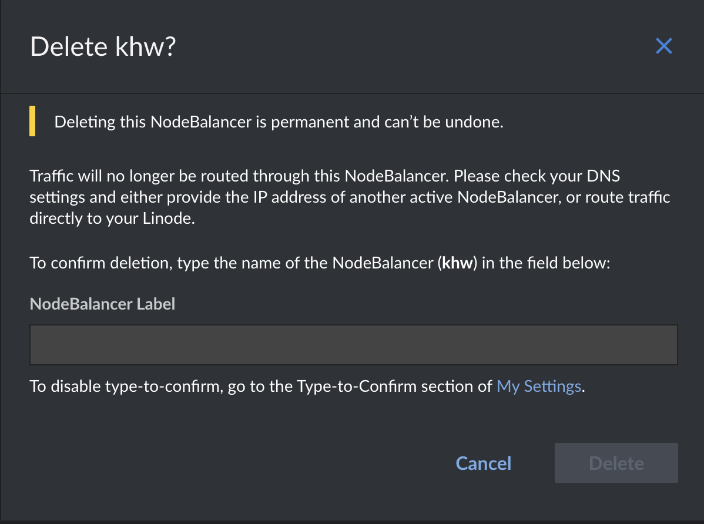

# Cleaning up

We've succesfully created a Kubernetes cluster the hard way. Once our learning activities are completed, we can teardown the resources we created. 

## Node Balancer

Login to the [CloudManager](https://cloud.linode.com/nodebalancers), and in the NodeBalancers section find in the list the one we created for the exercise. Click on the Delete link at the right and confirm the deletion.



## Compute instances

In our local environment, we list the instances we created during this exercise using

```sh
linode linodes ls --tag khw
```

If we add additional options to our command, we can get the list of Instance IDs 

```sh
linode linodes ls --tag khw --format id --text
```

```
id
XXXXXXX8
XXXXXXX9
XXXXXXX0
XXXXXXX3
XXXXXXX4
XXXXXXX5
```

Using this list, we can execute a loop that deletes each of them 

```sh
for id in XXXXXXX8 XXXXXXX9 XXXXXXX0 XXXXXXX3 XXXXXXX4 XXXXXXX5; do
    echo "Removing ${id}"
    linode linodes rm $id
done
```

> 💡 Double check that the ID's used in the loop match the actual instances to be deleted


